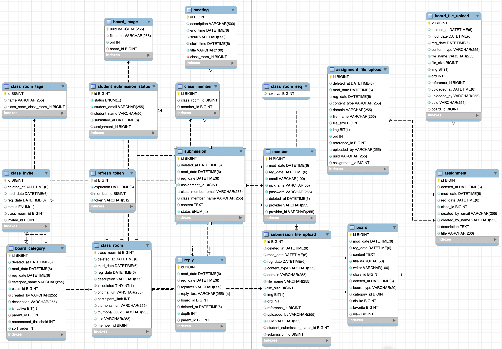
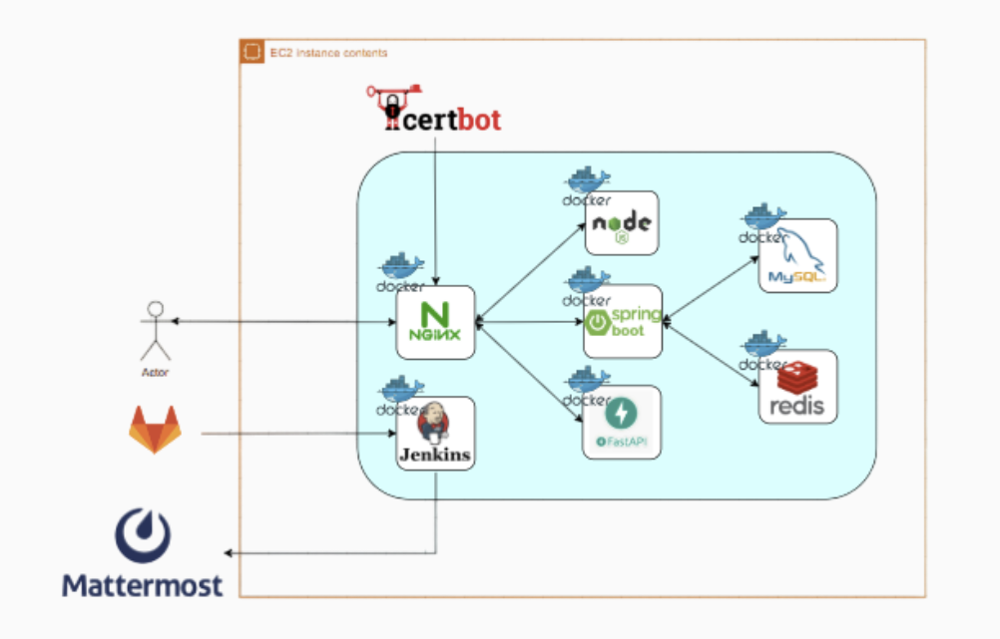
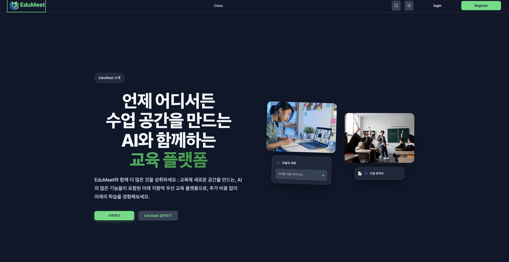
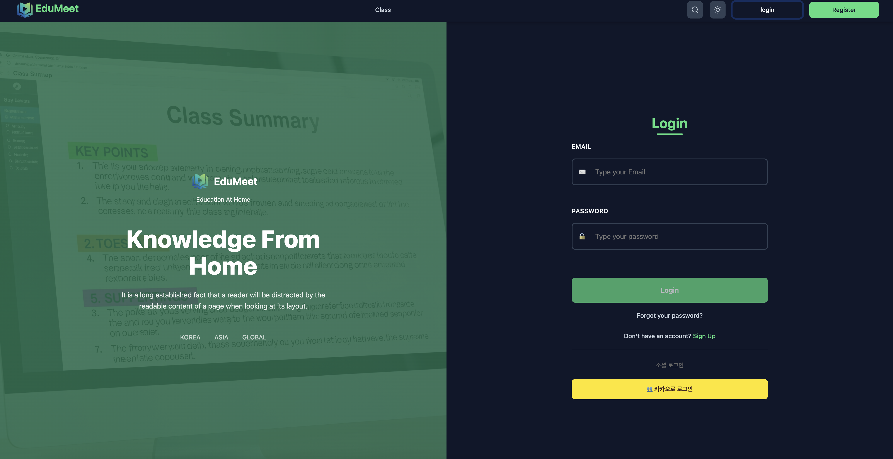
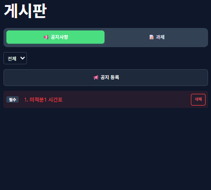
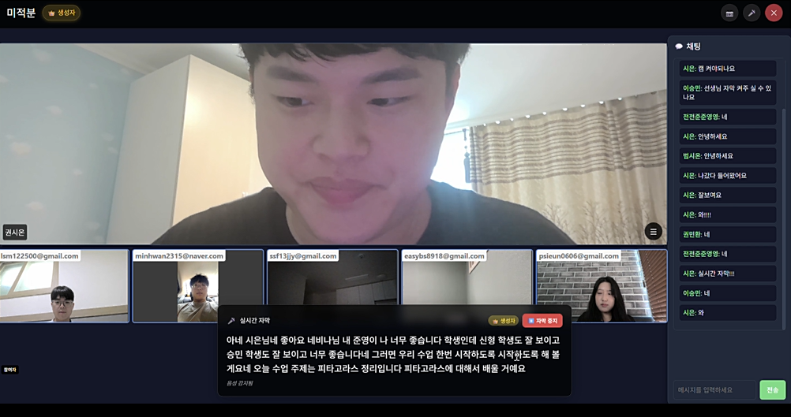
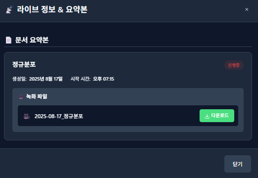
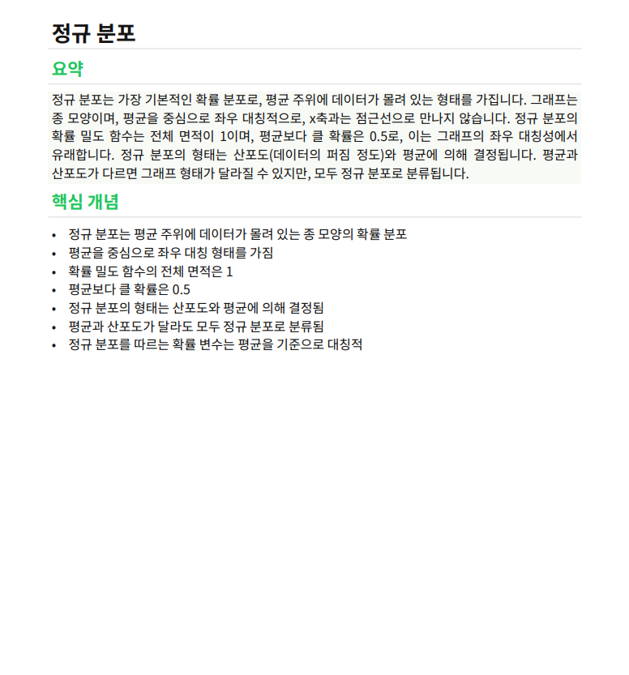

# EduMeet

**청각장애 학습자를 위한 온라인 교육 플랫폼.** 실시간 음성을 자막으로 바꿉니다.

**https://studywithtymee.com** · [API 문서](https://api.studywithtymee.com/swagger-ui/index.html)

```
2025.07 ~ 2025.08   6인 팀 개발 (SSAFY)
2026.08 ~           개인 리팩토링 — 측정 기반으로 성능·장애·운영 기반 재구축
```

---

## 이 저장소가 기록하는 것

기능을 늘리는 것이 아니라 **"어디서부터 무너지는가" 를 재고 고친 기록**입니다.
모든 변경에 전/후 측정을 붙였고, **개선이 없으면 없다고 적었습니다.**

| | |
|---|---|
| **측정 기록** | [`docs/`](docs/README.md) — 전송 비용·채팅 용량·HLS·배포·프록시 |
| **테스트** | 백엔드 **317건** + 파이썬 **30건** + 프론트 **28건**. 되돌려서 깨지는 것까지 확인 |
| **채택하지 않은 것** | 검토했지만 안 쓴 기술과 그 이유를 함께 남깁니다 |
| **틀렸던 것** | 근거가 나온 시점에 문서와 이슈를 고쳐 적었습니다 |

### 대표적인 측정

**채팅 상한은 "몇 명이 붙나" 가 아니라 "몇 명까지 채팅답나" 로 결정됩니다.**

| fan-out 구독자 | e2e p95 | 연결오류 |
|---:|---:|---:|
| 200 | 45 ms | 0 |
| 500 | **1,313 ms** | **0** |

연결은 하나도 안 끊겼습니다. 무너진 것은 지연입니다.
→ [`docs/performance/09-chat-capacity-oci.md`](docs/performance/09-chat-capacity-oci.md)

**nginx 기본값 하나가 WebSocket 을 60초마다 끊습니다.**

| `proxy_read_timeout` | 유지 | 조기 종료 |
|---|---:|---:|
| 60s (기본값) | **60.9초** | 3/3 |
| 3600s | 90.1초 | 0/3 |

에러 로그가 안 남고, 개발 중엔 안 보이고, **트래픽이 있으면 가려집니다.**
→ [`docs/performance/10-websocket-behind-proxy.md`](docs/performance/10-websocket-behind-proxy.md)

**"만들었는데 닿지 않는다" 를 아홉 번 만났습니다.**

| | |
|---|---|
| 설정값 4개 | `probes.enabled` · `prometheus.export` · `isAudioOnly()` · `sessionType` |
| 컨테이너 2개 | 관측 스택이 한 번도 켜진 적 없음 (compose 프로필) |
| **서비스 경계** | AI 요약본이 백엔드에 도달한 적 없음 (토큰·경로 불일치) |
| **제품의 존재 이유** | **AI 자막이 화면에 뜬 적 없음** (프론트에 STOMP 클라이언트 없음) |
| **인프라·화면** | WebRTC 계층이 운영에 연결되지 않았고, 방송 모드 2개가 서버 코드로만 존재 |

전부 **테스트를 통과하고 있었습니다.** 부품은 맞는데 연결이 없었습니다.
→ [`docs/ops/07-declared-but-unused.md`](docs/ops/07-declared-but-unused.md)

**방송 3모드는 송출과 배포 기준으로 갈랐습니다.**

| 모드 | 송출 구간 | 배포 구간 | 채팅 |
|---|---|---|---|
| 화상채팅 | 사용자 ↔ 사용자 | WebRTC SFU(LiveKit) | STOMP/WebSocket |
| 라이브 방송 | 현재 MediaRecorder HTTP chunk<br>확장 방향 RTMP/SRT/WebRTC ingest | HLS delivery(nginx/hls.js) | STOMP/WebSocket |
| 오디오 방송 | 현재 MediaRecorder audio chunk<br>확장 방향 RTMP/SRT ingest | audio-only HLS delivery | STOMP/WebSocket |

화상채팅은 양방향 저지연이라 SFU 가 필요합니다.
반면 방송은 발표자 한 명의 단방향 송출이라 화면 합성이 필요 없고,
그래서 LiveKit Egress 의 `RoomComposite` 대신 직접 HLS delivery 를 만들었습니다.
오디오는 "HLS audio mode" 가 아니라 **audio-only HLS delivery** 로 봅니다.
OCI aarch64 2 OCPU 에서 20초 720p30 입력 기준 H264 리먹싱은 real 0.084초,
VP8→H264 재인코딩은 real 5.456초였고, 운영 HLS URL 20 VU 측정은 HTTP 실패 0/1,968 이었습니다.
→ [`docs/plan/04-three-broadcast-modes.md`](docs/plan/04-three-broadcast-modes.md),
[`docs/plan/05-own-hls.md`](docs/plan/05-own-hls.md),
[`docs/plan/06-webrtc-sfu-100-policy.md`](docs/plan/06-webrtc-sfu-100-policy.md)

**그래서 모든 수정을 되돌려서 깨지는지 확인합니다.**
깨지지 않으면 그 테스트는 아무것도 지키지 않는 것입니다.
한 번은 실제로 안 깨졌고([#108](https://github.com/dj258255/edumeet/pull/109)),
*"지금은 중복이고 시험이 못 잡는다"* 를 주석과 시험 양쪽에 적었습니다.

---

## 📦 저장소 구성

**모노레포다.** 팀이 GitLab 에 나눠 두었던 저장소를 이력째 합쳤다.

```
backend/       Spring Boot 3.5 · Java 17 — API · WebSocket 채팅 · LiveKit 세션
frontend/      Vue 3 · Vite — 화상강의 · 라이브방송 · 채팅 UI
ai/            FastAPI · Python — STT 자막 파이프라인
mcp-server/    MCP stdio 서버 — 저장된 강의 자막 검색 (Claude Code · Desktop)
doc-summary/   Express · Node — 문서 요약 API

contracts/     Java · 파이썬 · MCP 가 함께 읽는 경계 계약
docs/          측정 기록과 판단 근거 (전송비용 · HLS · 채팅 용량 · 배포)
k6/            부하 측정 스크립트
deploy/  ansible/  observability/  scripts/
```

**이력을 보존했다.** `filter-repo --to-subdirectory-filter` 로 각 프로젝트의 모든 커밋 경로를
목적지 기준으로 재작성한 뒤 합쳤다. 그래서 `git log -- frontend/src/App.vue` 도,
`git blame` 도 2025년 팀 커밋까지 그대로 이어진다.

> `subtree add` 로 붙이면 병합 이전 커밋의 경로가 루트라서 `git log -- frontend/...` 가
> 아무것도 못 찾는다. **blame 은 되는데 log 는 안 되는** 어정쩡한 상태가 된다.

`.mailmap` 으로 한 사람이 여러 정체성으로 세어지던 것을 합쳤다
(`범수`/`BeomSu`, `권민환`/`kwonminhwan` 등). 커밋 SHA 는 건드리지 않는다 —
다시 쓰면 머지된 PR 90여 개의 참조가 전부 깨진다.

---

## 🪪 개요

### 교육의 기회는 누구에게나 열려있는 세계에서

### 사회적 약자들을 위한 첫 발판인 청각의 어려움 해소를 위해!

교육의 기회는 누구에게나

열려 있어야 합니다.

특히 사회적 약자들에게는

그 첫 발판이 되어야 합니다.

그 시작은 바로,

청각의 어려움을 해소하는 것에서부터 시작됩니다.

## 🚩 개발기간

|           |        [프로젝트 일정]        |
| :-------: |:-----------------------:|
| 진행 기간 | 2025.07.14 - 2025.08.22 |
|   인원    |           6명            |

<br/>

## 🚀 실행 방법

```bash
git clone https://github.com/dj258255/edumeet.git
cd edumeet
```

### 백엔드

```bash
cd backend
./gradlew test        # Docker 가 떠 있어야 한다 (아래 설명)
./gradlew bootRun     # 기본 프로필 local
```

**테스트에 Docker 가 필요합니다.** Testcontainers 로 **MySQL 8 · Redis 7** 을 띄웁니다.

> H2 를 쓰지 않는 이유 — H2 는 MySQL 의 `ENUM` 이나 `engine=InnoDB` 를 재현하지 못하고,
> 인메모리라 네트워크 왕복이 없어 **N+1 의 실제 비용이 드러나지 않습니다.**
> 한 번은 로컬에 떠 있던 다른 프로젝트의 Redis 때문에 **테스트가 잘못된 이유로 통과**한 적도 있습니다. (#49)

### 프론트

```bash
cd frontend
cp .env.example .env.local     # 값을 채운다
npm ci && npm run dev
```

**Node 22 를 쓰세요.** Node 25 에서는 `vite-plugin-vue-devtools` 가 설정 로드 시점에 죽습니다
(25 의 `localStorage` 는 객체로 존재하지만 `getItem` 이 없습니다).

### AI

```bash
cd ai
python -m venv .venv && . .venv/bin/activate
pip install -r requirements.txt
pytest -q
```

**Python 3.10 이상**이 필요합니다 (`str | None`, PEP 604). 3.9 에서는 import 조차 되지 않습니다.

### MCP 서버

저장된 강의 자막을 Claude Code · Claude Desktop 에서 찾고 읽습니다.

```bash
cd mcp-server
uv venv --python 3.12 .venv
VIRTUAL_ENV=.venv uv pip install -r requirements.txt
./.venv/bin/python -m pytest -q
```

도구는 셋입니다 — `list_caption_meetings` · `search_transcript` · `get_transcript`.
DB 를 직접 읽지 않고 **Java 내부 API 를 경유**합니다. 자막 정렬 규칙이 한 곳에만
있어야 하기 때문입니다. 그래서 `contracts/internal-api.json` 을
**Java · 파이썬 · MCP 셋이 함께 읽습니다.**

등록 방법과 환경변수는 [`mcp-server/README.md`](mcp-server/README.md).

### 설정

**프로필이 `application.yml` 한 파일 안에 있습니다.** 시크릿은 들어 있지 않습니다.

| | |
|---|---|
| `application.yml` | `local` · `test` · `perf` · `prod` 를 다중 문서로 (`spring.config.activate.on-profile`) |
| 값 주입 | 전부 `${ENV_VAR:기본값}` 형태. 안 채워도 로컬 기본값으로 뜬다 |
| `env.example` | 서버 `.env` 템플릿. 운영 값은 **Ansible vault** 에 있다 |

> 프로필별 파일을 나누지 않은 이유 — `prod` 문서에 `datasource` 를 안 둔 채 배포했다가
> **조용히 H2 로 뜬 적**이 있습니다. 공통을 한곳에 두고 프로필이 덮어쓰게 했습니다. (#49)

## 📌 개발 컨벤션

| 문서 | 내용 |
|---|---|
| **[docs/team-rules.md](docs/team-rules.md)** | 팀이 일하는 방식 (스크럼·토론·코드 리뷰·소통) |
| **[docs/team-convention.md](docs/team-convention.md)** | 코드·협업 컨벤션 (Git·백엔드·프론트엔드) |
| [CONTRIBUTING.md](CONTRIBUTING.md) | 기여 절차 요약 |

```
브랜치   <type>/<이슈번호>-<설명>      예: perf/4-n-plus-one
커밋     <type>: <한국어 subject>
type     feat · fix · refactor · perf · test · docs · style · chore
```

## 📃 개발 환경

### ⚒️ Back-End

- Springboot
- InteliJ
- JDK 17
- AWS EC2
- AWS S3
- MySQL
- Redis
- Nginx
- OpenVidu

### ⚒️ Front-End

- Vue
- OpenVidu

### ⚒️ CI/CD

- Jenkins

### ⚒️ 협업 툴

- Notion
- Jira
- GitLab

## 📝 API 명세서

### 노션 링크 첨부 🔗

https://charm-custard-27a.notion.site/API-2328d31b258e80acb086cd7b8f40c9e5

## ⚙️ ERD 다이어그램




## ⚙ 서비스 아키텍쳐



## 🎬 디자인 및 기능

### 메인화면


<br>
<br>
<br>
<br>

### 로그인



<br>
<br>
<br>
<br>

### 게시판



<br>
<br>
<br>
<br>

### 과제제출 게시판

선생님 입장.


<br>
<br>
<br>


<br>
<br>
<br>


<br>
<br>
<br>
<br>

학생입장


<br>
<br>
<br>
<br>

### 화상강의 및 STT



<br>
<br>
<br>
<br>

### AI 문서요약




<br>
<br>
<br>
<br>
