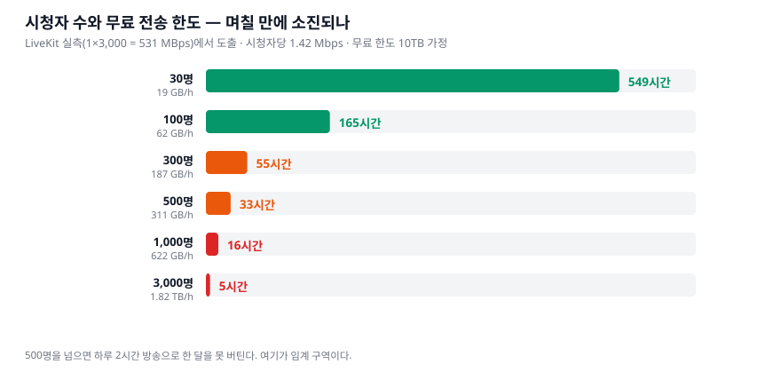
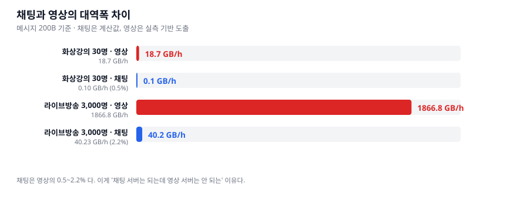
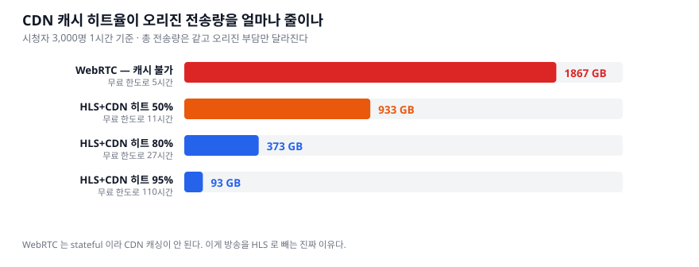

# 전송 비용 모델 — 어디서 돈이 터지나

> 작성 2026-08-22 · **요금은 자주 바뀐다.** 아래 무료 한도는 조사 확인 전 가정치이며,
> 실제 값은 [OCI 가격 페이지](https://www.oracle.com/cloud/price-list/)에서 재확인해야 한다.

## 0. 한 줄 결론

> **대역폭은 프로토콜이 아니라 "화질 × 시청자 수"로 결정된다.**
> WebRTC 와 HLS 의 차이는 **총 전송량이 아니라 그 부담을 누가 지느냐**다.

---

## 1. 기준점 — 유일한 실측치

**LiveKit 공식 벤치마크** (GCP `c2-standard-16`)

```
1 publisher × 3,000 subscriber  →  outbound 531 MBps
```

여기서 도출한다.

```
시청자당 대역폭     531 MB/s × 8 ÷ 3,000        = 1.42 Mbps
시청자당 시간당      1.42 Mbps × 3600 ÷ 8 ÷ 1024 = 0.622 GB
```

> **1.42 Mbps 는 720p 3 Mbps 보다 낮다.** LiveKit 의 adaptive stream 이
> 화면에 안 보이는 참가자의 구독을 이미 끊고 있기 때문이다.
> 즉 이 수치는 **최적화가 적용된 뒤의 실제값**이다.

**이 문서에서 실측은 위 한 줄뿐이고 나머지는 전부 계산이다.**

---

## 2. 임계 구역 — 시청자 수와 무료 한도



| 시청자 | 1시간 egress | 무료 10TB 소진까지 | 하루 2시간 방송 기준 |
|---:|---:|---:|---:|
| 30 | 19 GB | 549시간 | **274일** |
| 100 | 62 GB | 165시간 | 82일 |
| 300 | 187 GB | 55시간 | 27일 |
| **500** | **311 GB** | **33시간** | **16일** |
| 1,000 | 622 GB | 16시간 | 8일 |
| 3,000 | 1.82 TB | 5시간 | **3일** |
| 5,000 | 3.04 TB | 3시간 | 2일 |

> **500명이 임계 구역이다.** 여기를 넘으면 하루 2시간 방송으로 **한 달을 못 버틴다.**
>
> 그리고 **화상강의(30~100명) 규모에서는 전송 비용이 문제가 되지 않는다.**
> 274일이면 사실상 무제한이다. **비용 설계가 필요해지는 건 방송 쪽이다.**

---

## 3. 채팅은 영상의 2% 다



메시지 200B 기준.

| 시나리오 | 영상 | 채팅 | 비율 |
|---|---:|---:|---:|
| 화상강의 30명 · 초당 5건 | 18.7 GB/h | **0.10 GB/h** | **0.54%** |
| 라이브방송 3,000명 · 초당 20건 | 1,867 GB/h | **40.2 GB/h** | **2.16%** |

> **이게 "채팅 서버는 집에서도 되는데 영상 서버는 안 되는" 이유의 정량적 답이다.**
>
> 그리고 **채팅의 병목은 대역폭이 아니라 CPU·스레드**다.
> 40 GB/h 는 평균 11 MB/s 로 회선에 부담이 안 되지만,
> **fan-out 은 초당 6만 회 쓰기**(3,000명 × 20건)라 [붕괴 ②](../plan/01-chat-breaking-points.md)에 걸린다.

---

## 4. ★ CDN 이 바꾸는 것 — 총량이 아니라 부담 주체



**시청자 3,000명이 1시간 시청하면 총 전송량은 1.82 TB 로 프로토콜과 무관하게 같다.**
달라지는 것은 **오리진이 그중 얼마를 지느냐**다.

| 방식 | 오리진 egress | 무료 한도로 |
|---|---:|---:|
| **WebRTC** (캐시 불가) | **1,867 GB** | 5시간 |
| HLS + CDN 히트율 50% | 933 GB | 11시간 |
| HLS + CDN 히트율 80% | 373 GB | 27시간 |
| **HLS + CDN 히트율 95%** | **93 GB** | **110시간** |
| HLS + CDN 히트율 99% | 19 GB | 549시간 |

**95% 히트면 오리진 부담이 20배 줄고 임계가 5시간 → 110시간이 된다.**

### 왜 WebRTC 는 캐시가 안 되나

```
WebRTC   커넥션마다 SRTP 키가 다르고 서버가 상태를 보유
         → 같은 바이트를 재사용할 수 없다 → CDN 캐싱 불가
HLS      세그먼트가 그냥 정적 파일
         → 같은 파일을 N명이 받는다 → CDN 이 흡수
```

> **이게 "왜 방송은 WebRTC 말고 HLS+CDN 이냐"의 진짜 답이다.**
> CPU 도 지연도 아니고 **오리진 대역폭이 먼저 터지기 때문**이다.

### 다만 라이브는 VOD 보다 히트율이 낮다

```
플레이리스트(.m3u8)   EXT-X-ALLOW-CACHE:NO · target duration 마다 갱신 → 거의 매번 오리진
세그먼트(.ts)         한 번 만들어지면 불변 → 잘 캐시된다
```

**VOD 는 같은 파일을 반복 요청하므로 히트율이 훨씬 높다.**
그래서 **CDN 의 효과는 라이브보다 VOD 에서 크다.**

---

## 5. VOD 는 저장보다 전송이 비싸다

```
저장   동영상 1GB          →  Storage 요금 (한 번)
전송   1GB × 시청 횟수      →  Egress 요금 (볼 때마다)
```

| 영상 크기 | 시청 1,000회 | 시청 10,000회 |
|---:|---:|---:|
| 100 MB | 100 GB | 1 TB |
| 500 MB | 500 GB | 5 TB |
| 1 GB | **1 TB** | **10 TB** |

**1GB 영상을 1만 명이 보면 무료 한도(10TB)를 정확히 소진한다.**

그래서 **Spring Boot 가 영상 바이트를 직접 내려주면 안 된다.**

```
✗  GET /videos/123  →  Spring Boot 가 byte[] 로 응답
✓  GET /videos/123  →  권한 확인 후 서명된 URL 발급
                       실제 전송은 Object Storage / CDN
```

애플리케이션 서버는 **"볼 자격이 있나"** 만 판단하고,
**수백 MB 전송은 스토리지·CDN 에 맡긴다.**

---

## 6. 이 프로젝트에서 비용이 터지는 지점

```
1위  라이브 방송 시청자 500명 초과   →  임계. CDN 없이는 한 달을 못 버틴다
2위  VOD 를 앱 서버가 직접 서빙       →  1GB × 1만 회 = 무료 한도 전량
3위  WebRTC 로 대규모 시청           →  CDN 캐싱이 원천적으로 불가
```

**화상강의(30~100명)와 채팅은 비용 관점에서 문제가 아니다.**

---

## 7. 국내 맥락 — 왜 이게 남의 일이 아닌가

한국은 **발신자 종량제(상호접속고시 2016)** 라 CP 가 ISP 에 트래픽 종량 요금을 낸다.
미국·EU 는 망 중립성이라 이 구조가 아니다.

그래서 국내 플랫폼들이 **그리드 딜리버리(P2P CDN)** 로 갔다.

| | |
|---|---|
| 아프리카TV(SOOP) | 2007년부터 고화질 시청에 적용. 보도 기준 망사용료 **연 900억 → 150억** |
| 치지직 | **2024년 6월** 도입 |
| 트위치 | *"국내 망사용료가 다른 나라보다 높다"* → **한국 철수** |

**시청자 PC 가 받은 세그먼트를 다른 시청자에게 릴레이해 오리진 부담을 줄이는 방식**이다.
WebRTC mesh 가 아니라 **배포 계층의 최적화**다.

> **우리 규모에선 그리드가 무의미하다**(트래픽이 없다).
> 다만 **"대역폭이 곧 돈"이라는 제약이 아키텍처를 결정한다**는 것 자체가 이 문서의 요지다.

자세한 근거: [`research/03-fanout-messaging.md`](../research/03-fanout-messaging.md),
[`research/05-streaming-hls.md`](../research/05-streaming-hls.md)

---

## 8. 재현

```bash
python3 scripts/make_cost_chart.py
```

수치를 손으로 옮기지 않는다. 실측 기준점 하나(`531 MBps`)만 바꾸면 전부 다시 계산된다.

---

## 9. 미확인

- **OCI Always Free 의 outbound 무료 한도 정확한 값** — 위 계산은 10TB 가정
- Always Free 계정과 Pay-as-you-go 계정의 차이
- Object Storage egress 와 Compute egress 의 과금 차이
- CDN 오리진 요청의 실제 캐시 히트율 (라이브 기준 실측 사례)
