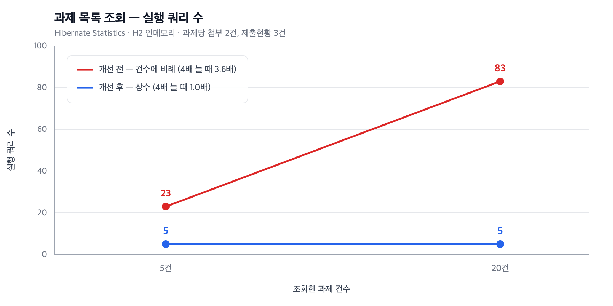
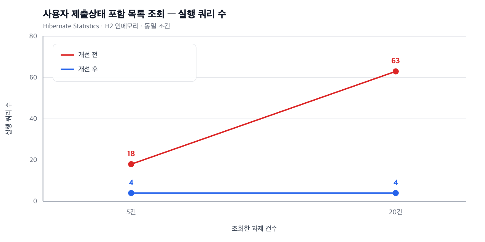

# 과제 목록 조회 N+1 제거

> 관련 이슈 [#4](https://github.com/dj258255/edumeet/issues/4) · PR [#10](https://github.com/dj258255/edumeet/pull/10)

## 한 줄 요약

과제 목록 조회의 실행 쿼리 수가 **과제 건수에 비례**하고 있었다.
원인을 두 단계로 나눠 제거해 **건수와 무관한 상수**로 만들었다. (20건 기준 83 → 5)



---

## 1. 문제 인식

과제 목록 조회 서비스가 이런 모양이었다.

```java
public List<AssignmentDTO> getAssignmentsByClassId(Long classId) {
    List<Assignment> assignments =
            assignmentRepository.findByClassIdOrderByRegDateDesc(classId);

    return assignments.stream()
            .map(assignment -> {
                List<Submission> submissions = submissionRepository
                        .findByAssignmentIdWithSubmissionFiles(assignment.getId());  // 건별 호출
                return domainToDtoWithSubmissionFiles(assignment, submissions, attachmentAdapter);
            })
            .collect(Collectors.toList());
}
```

`stream().map()` 안에서 과제마다 리포지토리를 호출한다. 전형적인 N+1 형태다.

### 그런데 이미 "N+1 최적화" 테스트가 있었다

`N1QueryOptimizationTest` 라는 테스트가 존재했고, `@BatchSize` 주석에도
`// N+1 문제 해결` 이라고 적혀 있었다. **해결됐다고 되어 있는 상태였다.**

```java
@OneToMany(...) @BatchSize(size = 20)   // N+1 문제 해결
private Set<AssignmentFileUploadJpaEntity> attachmentFiles = new HashSet<>();
```

그래서 먼저 **정말 해결되어 있는지부터 확인**하기로 했다.

---

## 2. 기존 테스트가 아무것도 검증하지 않고 있었다

`N1QueryOptimizationTest` 의 실제 내용이다.

```java
long startTime = System.currentTimeMillis();
AssignmentDTO result = assignmentService.getAssignmentWithAllDetails(testAssignmentId);
long endTime = System.currentTimeMillis();

assertThat(result).isNotNull();
assertThat(result.getAttachmentFiles().size()).isEqualTo(2);
assertThat(result.getStudentSubmissionStatuses().size()).isEqualTo(3);
```

- **시간만 재고 단언에 쓰지 않는다.** `startTime`/`endTime` 은 로그로만 나간다
- **단언은 결과 개수뿐**이다. 페치 조인을 전부 제거해도 개수는 같으므로 통과한다
- 목록 조회를 검증하는 `testClassAssignmentListOptimization` 은 **단언이 아예 없고** 로그만 찍는다

**즉 이 테스트는 페치 조인을 전부 지워도 통과한다.** 거짓 안전감을 주고 있었다.

---

## 3. 측정 — 쿼리 수를 세는 테스트를 먼저 만들었다

시간(ms)을 지표로 쓰지 않았다. 로컬 시간 측정은 JIT 워밍업·자원 경합·캐시 상태에 좌우되어
재현되지 않는다. 반면 **쿼리 수는 환경과 무관하게 재현된다.**

Hibernate `Statistics` 로 실제 실행된 statement 수를 세고,
**과제 건수를 5건과 20건으로 달리해 쿼리 수가 비례하는지**를 검증했다.
절대값이 아니라 **증가율**을 보므로 환경 차이에 덜 민감하다.

```java
private long countQueries(Runnable action) {
    entityManager.flush();
    entityManager.clear();      // 1차 캐시가 쿼리 수를 가리지 않게
    statistics.clear();
    action.run();
    return statistics.getPrepareStatementCount();
}

assertThat(large)
        .as("과제 %d건(쿼리 %d) -> %d건(쿼리 %d). 쿼리 수가 건수에 비례한다면 N+1이다",
                SMALL_COUNT, small, LARGE_COUNT, large)
        .isLessThanOrEqualTo(small + QUERY_COUNT_TOLERANCE);
```

### 측정 결과 — N+1 이 실재했다

| 과제 건수 | 실행 쿼리 |
|---|---|
| 5건 | 23 |
| 20건 | **83** |

**과제가 4배 늘 때 쿼리는 3.6배 늘었다.** 거의 정확히 선형이다.

> 이 테스트를 **먼저 커밋**했다.
> 고치기 전에 문제가 실재했다는 증거를 이력에 남기기 위해서다.
> [`7fcc5ed`](https://github.com/dj258255/edumeet/commit/7fcc5ed) 시점에는 테스트가 실패한다.

---

## 4. 1차 시도 — 배치 조회로 바꿨다. 그런데 부족했다

건별 호출을 IN 절 배치 조회로 바꾸고 메모리에서 묶었다.

```java
List<Long> assignmentIds = assignments.stream().map(Assignment::getId).toList();

Map<Long, List<Submission>> submissionsByAssignmentId =
        submissionRepository.findByAssignmentIdsWithSubmissionFiles(assignmentIds)
                .stream()
                .collect(Collectors.groupingBy(Submission::getAssignmentId));
```

### 결과: 83 → 64. **여전히 건수에 비례했다.**

| 과제 건수 | 1차 시도 후 |
|---|---|
| 5건 | 19 |
| 20건 | **64** (여전히 3.4배 증가) |

여기서 멈추지 않고 **왜 아직 비례하는지**를 봤다.

---

## 5. 진단 — 통계를 세분화했다

`getPrepareStatementCount()` 하나만 보면 원인을 알 수 없다. 항목을 나눠서 찍었다.

```java
log.debug("statement={} entityLoad={} collectionLoad={} collectionFetch={} queryExec={}",
        statistics.getPrepareStatementCount(),
        statistics.getEntityLoadCount(),
        statistics.getCollectionLoadCount(),
        statistics.getCollectionFetchCount(),
        statistics.getQueryExecutionCount());
```

```
과제 20건:  prepareStatement=64   queryExec=2   collectionFetch=62
```

**HQL 쿼리는 2건뿐인데 statement 는 64건.** 차이 62건이 전부 컬렉션 개별 로딩이었다.
1차 시도는 성공했고(쿼리 2건), 원인은 다른 곳에 있었다.

### 범인

```java
// StudentSubmissionStatusJpaEntity
@OneToMany(mappedBy = "studentSubmissionStatus", cascade = CascadeType.ALL,
           orphanRemoval = true, fetch = FetchType.LAZY)
// @BatchSize 없음
private Set<SubmissionFileUploadJpaEntity> submissionFiles = new HashSet<>();

public StudentSubmissionStatus toDomain() {
    attachments = this.submissionFiles.stream()...   // 즉시 접근 -> 지연 로딩 트리거
}
```

`@BatchSize` 가 없는 컬렉션을 `toDomain()` 이 즉시 접근한다.

```
과제 20건 × 제출현황 3건 = 제출현황 60건이 개별 로딩
62 = 60 + 2   ← 정확히 일치
```

### 그리고 이건 이 컬렉션만의 문제가 아니었다

`@BatchSize` 가 없는 `@OneToMany` 를 전수 조사했더니 **8곳**이 나왔다.

```
BoardCategoryJpaEntity.children
BoardJpaEntity.(replies)
StudentSubmissionStatusJpaEntity.submissionFiles
Member.classRooms / Member.classMembers
ClassRoom.classMember / ClassRoom.tags / ClassRoom.meetings
```

**컬렉션마다 애노테이션을 붙이는 방식은 새 컬렉션이 추가될 때 조용히 누락된다.**
누락돼도 테스트가 잡아주지 않으면 아무도 모른다.

---

## 6. 조치 — 전역 설정으로 전환

```yaml
spring:
  jpa:
    properties:
      hibernate:
        default_batch_fetch_size: 100
```

개별 `@BatchSize` 는 남겨두어 다른 크기가 필요한 곳에서 재정의할 수 있게 했다.

---

## 7. 결과

### 과제 목록 조회

| 과제 건수 | Before | 1차 시도 후 | **최종** |
|---|---|---|---|
| 5건 | 23 | 19 | **5** |
| 20건 | **83** | 64 | **5** |
| 증가율 (5→20건) | 3.6배 | 3.4배 | **1.0배** |

### 사용자 제출상태 포함 조회



| 과제 건수 | Before | After |
|---|---|---|
| 5건 | 18 | **4** |
| 20건 | **63** | **4** |

**쿼리 수가 조회 건수와 무관한 상수가 되었다.**

---

## 8. 측정 환경

| 항목 | 값 |
|---|---|
| DB | H2 인메모리 (`MODE=MySQL`) |
| 측정 도구 | Hibernate `Statistics.getPrepareStatementCount()` |
| 데이터 | 과제당 첨부 2건, 제출현황 3건 |
| 전처리 | `entityManager.flush()` → `clear()` → `statistics.clear()` |
| 트랜잭션 | `@Transactional` + `@Rollback` |

---

## 9. 한계 (정직하게)

- **H2 인메모리에서 측정했다.** MySQL 실환경의 실행계획·인덱스 동작은 다를 수 있다.
  다만 **쿼리 수**는 ORM 레벨의 지표라 DB 종류와 무관하다.
- **응답 시간을 측정하지 않았다.** 로컬 단일 머신에서 잰 시간은
  JIT 워밍업·자원 경합·캐시 상태에 좌우되어 신뢰할 수 없다고 판단했다.
  실제 응답 시간 개선폭은 데이터 규모와 네트워크 왕복 비용에 따라 달라진다.
- **데이터 규모가 작다.** 과제 20건은 실서비스 규모가 아니다.
  다만 이 측정의 목적은 절대 성능이 아니라 **"쿼리 수가 건수에 비례하는가"** 이고,
  그 성질은 규모와 무관하게 성립한다.
- **`default_batch_fetch_size: 100` 의 값 자체는 근거가 약하다.**
  IN 절 파라미터 수가 너무 커지면 DB 쪽 파싱 비용이 늘 수 있다.
  실데이터에서 재측정이 필요하다.

---

## 10. 남은 과제

`findByClassIdWithAllDetailsOrderByRegDateDesc` 계열은 컬렉션 **두 개를 동시에**
`LEFT JOIN FETCH` 한다.

```java
@Query("SELECT DISTINCT a FROM AssignmentJpaEntity a " +
       "LEFT JOIN FETCH a.attachmentFiles " +
       "LEFT JOIN FETCH a.studentSubmissionStatuses " + ...)
```

`Set` 이라 `MultipleBagFetchException` 은 나지 않지만 **카테시안 곱**은 그대로 발생한다.
첨부 M건 × 제출현황 N건 = M×N 행을 읽어 애플리케이션에서 중복을 제거한다.

**그런데 이 쿼리는 현재 아무도 호출하지 않는다.**
`AssignmentRepository`(Port 인터페이스)가 이 메서드를 노출하지 않아
서비스가 접근할 수 없기 때문이다. 최적화 쿼리를 만들어두고 쓰지 못하는 상태였다.

→ Port 계층의 구조적 문제이므로 [#3](https://github.com/dj258255/edumeet/issues/3) 에서 함께 처리한다.

---

## 11. 배운 것

1. **"해결했다"는 주석과 테스트를 믿지 말고 측정할 것.**
   `@BatchSize` 에 `// N+1 문제 해결` 이라고 적혀 있었고 최적화 테스트도 있었지만,
   그 테스트는 아무것도 검증하지 않고 있었다.

2. **한 번 고치고 멈추지 말 것.** 1차 시도로 83 → 64 가 됐지만 증가율은 그대로였다.
   "줄었다"가 아니라 **"성질이 바뀌었는가"** 를 봐야 했다.

3. **애노테이션 기반 설정은 누락에 취약하다.** 컬렉션마다 붙이는 방식은
   새 코드에서 조용히 빠진다. 전역 기본값 + 필요 시 재정의가 안전하다.

4. **테스트를 먼저 실패시킬 것.** 실패하는 테스트를 먼저 커밋하면
   "고치기 전에 문제가 있었다"가 이력으로 남는다.
