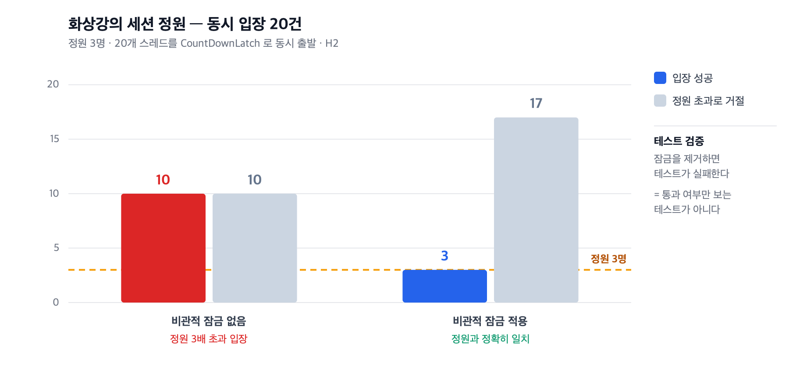

# 세션 정원 동시성 제어

> 관련 이슈 [#2](https://github.com/dj258255/edumeet/issues/2)

> **⚠ 이 문서의 동시성 테스트는 H2 위에서 JUnit 스레드로 돈다.**
> H2 의 잠금과 MySQL InnoDB 의 `SELECT ... FOR UPDATE` 는 동작이 다르고,
> JUnit 스레드는 HTTP 계층·커넥션 풀을 건너뛴다.
> MySQL 에서 k6 로 재검증한 결과는
> [04. 세션 정원 제어 — MySQL InnoDB 재검증](04-session-capacity-mysql.md)에 있다.

## 한 줄 요약

정원 3명짜리 화상강의에 **동시 입장 20건**이 몰릴 때 10명이 들어가고 있었다.
세션 행에 비관적 쓰기 잠금을 걸어 **정확히 3명**만 입장하도록 고쳤다.



---

## 1. 왜 정원이 화상강의에만 있는가

`SessionType` 을 도입하면서 정원 규칙이 형태마다 달라졌다.

| | `INTERACTIVE` (화상강의) | `BROADCAST` (라이브방송) |
|---|---|---|
| 프로토콜 | WebRTC | LL-HLS |
| **정원** | **`ClassRoom.participantLimit` 적용** | **제한 없음** |
| 참여 권한 | 발언·화면공유 | 시청 + 채팅 |
| 비용 축 | **서버 CPU** | **대역폭** |

**WebRTC 는 SFU 가 참가자 수만큼 스트림을 중계**하므로 CPU 한계가 곧 인원 한계다.
반면 **LL-HLS 는 세그먼트를 배포하는 구조**라 인원이 늘어도 서버 연산이 늘지 않는다.
늘어나는 것은 대역폭 비용이다.

그래서 **"같은 강의실인데 왜 라이브 회차만 정원이 없는가"** 가 도메인 규칙이 된다.

---

## 2. 문제 — 정원 검증은 원자적이지 않다

```java
if (meeting.hasParticipantLimit()) {
    long current = participantRepository.countActiveByMeetingId(meetingId);   // 1. 센다
    if (current >= meeting.participantLimit()) throw ...;                     // 2. 비교한다
}
participantRepository.save(MeetingParticipant.join(meeting, email));          // 3. 기록한다
```

**세 단계가 원자적이지 않다.**
동시 요청이 모두 1번에서 "현재 0명"을 읽으면 전부 2번을 통과하고 3번을 실행한다.

라이브 시작 직후처럼 **입장이 한 순간에 몰리는 상황**이 정확히 이 경우다.

---

## 3. 측정 — 테스트를 먼저 만들었다

20개 스레드를 `CountDownLatch` 로 **같은 순간에 출발**시킨다.

```java
for (int i = 0; i < CONCURRENT_REQUESTS; i++) {
    pool.submit(() -> {
        ready.countDown();
        start.await();                              // 전부 여기서 대기하다 동시에 출발
        openviduService.joinSession(meetingId, email, false);   // 현재 이름: meetingService (#57)
        ...
    });
}
ready.await(10, TimeUnit.SECONDS);
start.countDown();
```

> **이 테스트에는 `@Transactional` 을 쓰지 않았다.**
> 클래스 레벨 트랜잭션을 걸면 모든 스레드가 같은 커넥션을 공유해
> **경쟁 자체가 재현되지 않는다.** 정리는 `@AfterEach` 에서 직접 한다.

### 결과 (수정 전)

```
정원 3명 · 동시 요청 20건 -> 성공 10건
```

**정원의 3배가 넘게 입장했다.**

---

## 4. 조치 — 세션 행에 비관적 쓰기 잠금

```java
/**
 * "현재 인원을 세고 -> 정원과 비교하고 -> 참가를 기록한다"는 세 단계가
 * 원자적이지 않으면 동시 요청이 모두 정원 검사를 통과해 초과 입장이 발생한다.
 * 세션 행을 잠가 이 구간을 직렬화한다.
 */
@Lock(LockModeType.PESSIMISTIC_WRITE)
@Query("SELECT m FROM Meeting m WHERE m.id = :id")
Optional<Meeting> findByIdForUpdate(@Param("id") Long id);
```

### 왜 비관적 잠금인가

| 방식 | 판단 |
|---|---|
| **비관적 잠금** | **선택.** 경쟁이 실제로 잦은 구간이고, 임계 구역이 짧다 |
| 낙관적 잠금(`@Version`) | 충돌 시 재시도가 필요하다. 입장 폭주는 충돌률이 높아 재시도가 몰린다 |
| DB 유니크 제약 | 중복 입장은 막지만 **개수 상한은 제약으로 표현할 수 없다** |
| 애플리케이션 락 | 인스턴스가 늘면 동작하지 않는다 |

중복 입장 방지는 별개로 `(meeting_id, participant_email)` 유니크 제약을 두었다.

---

## 5. ★ 이 테스트가 실제로 문제를 잡는지 확인했다

통과 여부만 보면 그 테스트가 진짜 검증인지 알 수 없다. **잠금을 제거하고 다시 돌렸다.**

| | 동시 요청 | 입장 성공 | 판정 |
|---|---|---|---|
| 비관적 잠금 **없음** | 20 | **10** | 정원 3배 초과 |
| 비관적 잠금 **적용** | 20 | **3** | 정원과 정확히 일치 |

```
$ # @Lock 제거 후
SessionCapacityConcurrencyTest > 화상강의는 동시 입장이 몰려도 정원을 넘지 않는다 FAILED
  [측정] 화상강의 정원 3명 · 동시 요청 20건 -> 성공 10 / 거절 10
```

**잠금을 지우면 테스트가 실패한다.** 개수를 채우는 테스트가 아니다.

---

## 6. 부수적으로 고친 것 — 라이브 시청자가 발행할 수 있었다

```java
// 이전 — 모든 참가자에게 동일한 권한
token.addGrants(new RoomJoin(true), new RoomName(roomName));
```

`RoomJoin` 만 부여하면 **참가자가 미디어를 발행할 수 있다.**
라이브방송 시청자에게는 맞지 않는다.

```java
// 이후 — 세션 형태와 진행자 여부로 분기
boolean canPublish = isHost || meeting.getSessionType().allowsParticipantPublish();
token.addGrants(
        new RoomJoin(true),
        new RoomName(roomName),
        new CanPublish(canPublish),
        new CanSubscribe(true)
);
```

---

## 7. 측정 환경

| 항목 | 값 |
|---|---|
| DB | H2 인메모리 (`MODE=MySQL`) |
| 동시성 | 스레드 20개, `CountDownLatch` 로 동시 출발 |
| 정원 | 3명 |
| 트랜잭션 | 스레드별 독립 (테스트에 `@Transactional` 미사용) |

---

## 8. 한계 (정직하게)

- **H2 에서 측정했다.** MySQL 의 `SELECT ... FOR UPDATE` 는 잠금 범위와
  갭 락 동작이 다르다. 실환경 재검증이 필요하다.
- **단일 인스턴스 기준이다.** 애플리케이션을 여러 대로 늘려도 DB 행 잠금이므로
  동작은 유지되지만, 잠금 경합이 커넥션 풀을 압박할 수 있다. 그 지점은 측정하지 않았다.
- **퇴장 처리에 의존한다.** `leftAt` 이 기록되지 않으면 정원이 계속 소비된다.
  브라우저를 그냥 닫는 경우를 다루려면 LiveKit 의 참가자 이벤트를 받아
  동기화해야 한다. 이번 범위에 포함하지 않았다.
- **스레드 20개는 실제 폭주 규모가 아니다.** 다만 이 측정의 목적은 처리량이 아니라
  **"정원을 넘는가"** 이고, 그 성질은 규모와 무관하게 성립한다.

---

## 9. 배운 것

1. **테스트를 지워보기 전까지는 그게 검증인지 알 수 없다.**
   잠금을 제거해 실패를 확인하고 나서야 이 테스트에 의미가 생겼다.

2. **동시성 테스트에 `@Transactional` 을 걸면 경쟁이 사라진다.**
   모든 스레드가 같은 커넥션을 공유하기 때문이다. 정리 비용을 감수하고 빼야 한다.

3. **개수 상한은 DB 제약으로 표현할 수 없다.**
   유니크 제약은 중복을 막을 뿐이다. 상한은 애플리케이션이 임계 구역으로 지켜야 한다.
