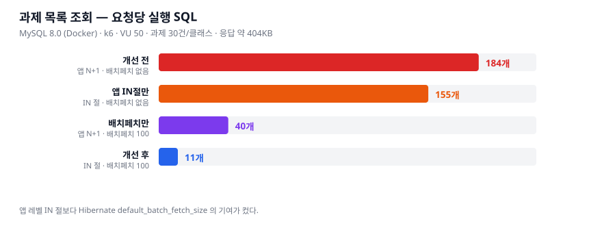
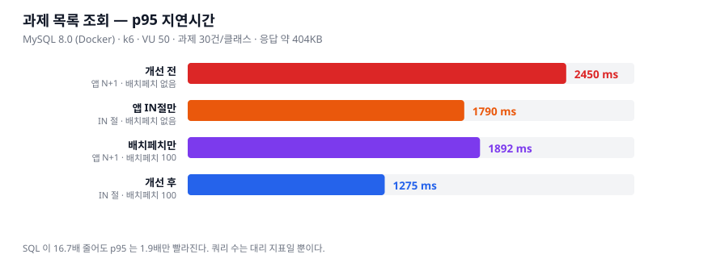
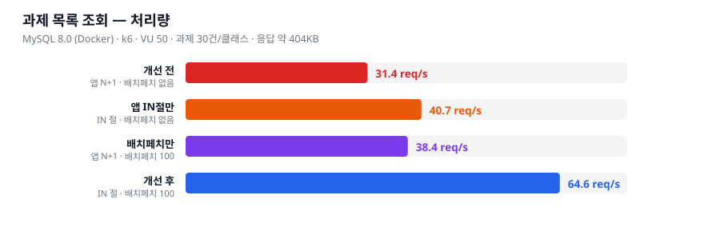

# 03. MySQL 부하 측정 — 쿼리 수는 대리 지표일 뿐이다

> 이슈 [#17](https://github.com/dj258255/edumeet/issues/17)

## 왜 다시 쟀나

[01 문서](01-assignment-list-n-plus-one.md)에서 과제 목록 조회의 N+1 을 제거하고
**쿼리 83건 → 5건**을 기록했다. 그 측정에는 두 가지 구멍이 있었다.

1. **H2 로 쟀다.** 운영 DB 는 MySQL 인데 옵티마이저·인덱스·커넥션 풀 동작이 다르다.
   쿼리가 줄었다는 사실이 MySQL 에서 몇 ms 인지는 말해주지 않는다.
2. **지연시간을 재지 않았다.** 쿼리 수는 *"고친 게 진짜 고쳐졌다"* 는 구조의 증거이지
   *"그게 체감된다"* 는 증거가 아니다.

그래서 MySQL 8.0 위에서 k6 로 다시 쟀다.

## 측정 환경

| | |
|---|---|
| DB | MySQL 8.0 (Docker), `innodb-buffer-pool-size=512M`, `max-connections=200` |
| 커넥션 풀 | HikariCP, `maximum-pool-size=60` (VU 50 보다 크게 잡아 풀이 병목이 되지 않게) |
| 데이터 | 클래스 5개 × 과제 30건, 과제당 학생 상태 20건·제출 15건, 총 10,350행 |
| 부하 | k6, VU 50, 램프업 15s + 유지 60s |
| 응답 크기 | 약 404KB (과제 30건 + 첨부 + 제출 + 제출파일) |

**측정 전 워밍업을 따로 돌린다.** JVM 은 처음 수천 번 호출까지 인터프리터로 돌고,
InnoDB 는 버퍼 풀이 비어 있으면 디스크를 읽는다. 워밍업 없이 재면 *먼저 돌았다는
이유만으로* 느리게 나온다.

재현:

```bash
docker compose -f docker-compose.perf.yml up -d
./scripts/run-benchmark.sh
python3 scripts/make_k6_chart.py
```

## 왜 2×2 인가

개선은 **두 가지**였는데 01 문서는 둘을 뭉뚱그렸다.

| | 무엇을 바꿨나 |
|---|---|
| (1) 앱 레벨 | 과제마다 제출물을 조회하던 것을 `IN` 절 한 번으로 묶음 |
| (2) Hibernate | `default_batch_fetch_size: 100` 으로 지연 로딩 컬렉션을 묶음 |

둘을 같이 켜고 끄면 **어느 쪽이 얼마나 기여했는지 말할 수 없다.**
(2)는 요청 단위로 못 바꾸는 전역 설정이라 앱을 두 번 띄워서 비교했다.

같은 JVM·같은 데이터에서 전략만 바꿔야 차이가 조회 전략에서 왔다고 말할 수 있으므로,
(1)은 `?strategy=naive|batch` 쿼리 파라미터로 토글한다. `naive` 경로는 추측이 아니라
**커밋 `314e60f` 이전의 실제 코드**를 그대로 옮겼다.

## 결과







| 조합 | 앱 IN절 | 배치페치 | 요청당 SQL | 처리량 | p95 | 평균 |
|---|:---:|:---:|---:|---:|---:|---:|
| **개선 전** | ✗ | ✗ | **184** | 31.4 req/s | 2,450 ms | 1,400 ms |
| 앱 IN절만 | ✓ | ✗ | 155 | 40.7 req/s | 1,790 ms | 1,079 ms |
| 배치페치만 | ✗ | ✓ | 40 | 38.4 req/s | 1,892 ms | 1,144 ms |
| **개선 후** | ✓ | ✓ | **11** | **64.6 req/s** | **1,275 ms** | **679 ms** |

**개선 전 → 후: SQL 16.7배 감소, 처리량 2.06배, p95 48% 감소.**

## 여기서 배운 것

### 1. 쿼리 수와 처리량은 단조 관계가 아니다

표를 다시 보자. **`배치페치만`은 `앱 IN절만`보다 SQL 이 4배 적은데 처리량이 더 낮다.**

```
앱 IN절만      SQL 155  →  40.7 req/s
배치페치만     SQL  40  →  38.4 req/s   ← SQL 은 1/4 인데 더 느리다
```

쿼리 **개수**가 아니라 **쿼리가 하는 일의 총량**이 비용이다. `naive` 경로의 제출물
조회는 과제마다 `LEFT JOIN FETCH` 를 돌려 카테시안 곱 행을 만들어낸다. 개수가 적어도
한 건이 비싸면 총합은 줄지 않는다.

**쿼리 수는 대리 지표(proxy metric)다.** 구조가 고쳐졌는지 확인하는 데는 좋지만,
그것만으로 빨라졌다고 말하면 안 된다.

### 2. 개선하면 병목이 옮겨간다

왜 SQL 을 16.7배 줄였는데 처리량은 2배에서 멈추나. CPU 배분을 재봤다.

| strategy | 요청당 SQL | 앱 CPU | MySQL CPU |
|---|---:|---:|---:|
| `naive` | 40 | 68% | **225%** |
| `batch` | 11 | **126%** | 131% |

*(12코어 = 1200%. VU 50, 램프업 이후 18초간 2초 간격 9회 샘플의 평균)*

`naive` 는 MySQL 이 앱의 **3.3배** CPU 를 쓴다. DB 쪽 작업이 지배적이다.
`batch` 로 바꾸면 거의 **1:1** 이 된다. 쿼리를 줄인 만큼 DB 작업 비중이 줄었고,
그 결과 **병목이 앱 쪽(엔티티 매핑·JSON 직렬화)으로 옮겨갔다.**

병목이 옮겨간 뒤로는 쿼리를 더 줄여도 처리량이 그만큼 늘지 않는다.
다음에 손댈 곳은 쿼리가 아니라 **응답 크기**다. 404KB 를 매 요청 직렬화하고 있다.

### 3. 이 수치의 한계 (중요)

- **앱·MySQL·k6 가 모두 같은 노트북에서 돌았다.** k6 도 CPU 를 쓴다.
  절대 수치는 운영 수치가 아니다. **같은 조건에서의 상대 비교만 유효하다.**
- CPU 총합이 300% 안팎(1200% 중)이라 **어느 쪽도 포화되지 않았다.**
  따라서 "MySQL 이 병목이었다"가 아니라 **"DB 작업 비중이 지배적이었다"** 가 정확한 표현이다.
- 응답 404KB 는 이 시드 데이터 기준이다. 실제 클래스의 과제 수·제출 수에 따라 달라진다.

## 01 문서의 수치는 왜 다른가

01 문서는 H2 에서 **83 → 5**, 여기서는 MySQL 에서 **184 → 11** 이다.
데이터 규모가 다르기 때문이다(과제 20건 vs 30건, 제출·첨부 건수도 다르다).
**두 수치는 서로 모순이 아니라 다른 조건의 측정이다.** 01 은 구조가 고쳐졌음을,
03 은 그것이 체감되는 정도를 보인다.
