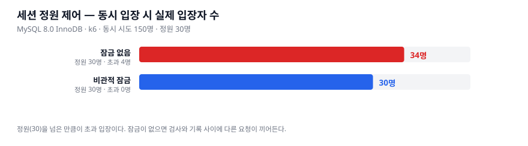

# 04. 세션 정원 제어 — MySQL InnoDB 에서 재검증

> 이슈 [#17](https://github.com/dj258255/edumeet/issues/17)

## 왜 다시 쟀나

[02 문서](02-session-capacity-concurrency.md)에서 비관적 잠금으로 정원 초과 입장을
막고, 20 스레드 동시성 테스트로 검증했다. 그 테스트는 **H2 위에서 JUnit 으로** 돈다.

H2 의 잠금과 MySQL InnoDB 의 `SELECT ... FOR UPDATE` 는 동작이 다르다.
InnoDB 에는 **잠금 대기 타임아웃**과 **교착 상태 감지**가 있어서, H2 에서 통과한 코드가
MySQL 에서 다르게 동작할 수 있다. 그리고 JUnit 스레드는 HTTP 계층·커넥션 풀·
트랜잭션 경계를 건너뛴다.

## 측정 방법

정원(30)보다 훨씬 많은 150명이 **동시에** 입장을 시도한다.

```bash
./scripts/run-session-benchmark.sh
```

k6 의 `per-vu-iterations` 로 VU 150개가 각각 1회씩, 램프업 없이 몰린다.
**램프업을 두면 경합이 흩어져 잠금이 없어도 우연히 정원을 지킬 수 있다.**

참가 기록에 `(meeting_id, participant_email)` 유니크 제약이 있으므로 VU 마다
다른 이메일을 쓴다. 같은 이메일이면 정원을 재소비하지 않는다.

대조군(`lock=false`)은 `findByIdForUpdate` 를 `findById` 로 바꾼 것 외에는
운영 코드와 동일하다.

## 결과



| | 동시 시도 | 정원 | 실제 입장 | 초과 | 성공/거절 | p95 |
|---|---:|---:|---:|---:|---:|---:|
| **잠금 없음** | 150 | 30 | **34** | **4** | 34 / 116 | 175 ms |
| **비관적 잠금** | 150 | 30 | **30** | **0** | 30 / 120 | 438 ms |

**잠금이 없으면 4명이 정원을 넘어 들어왔다. 잠금이 있으면 정확히 정원만큼이다.**

정원 검증은 *"현재 인원을 센다 → 정원과 비교한다 → 참가를 기록한다"* 의 세 단계다.
원자적이지 않으면 동시 요청이 **모두** 검사를 통과한다. 세션 행에 쓰기 잠금을 걸어
이 구간을 직렬화한다.

## 잠금은 공짜가 아니다

**p95 가 175ms → 438ms 로 2.5배 느려졌다.** 입장 요청이 세션 행 하나를 두고
직렬화되기 때문이다. 이건 버그가 아니라 **정합성의 값**이다.

정원 제어가 필요 없는 곳까지 잠그면 이 비용만 낸다. 그래서 라이브방송(`BROADCAST`)은
정원 제한이 없고([#2](https://github.com/dj258255/edumeet/issues/2)), 정원 검사 자체를
건너뛴다.

## 부수적으로 발견한 것 — Spring AOP 자기 호출

대조군(잠금 없는 참가)을 처음엔 **컨트롤러 안에** `@Transactional` 메서드로 두었다.

```java
@RestController
class SessionBenchmarkController {
    public ResponseEntity<?> join(...) {
        return joinWithoutLock(...);   // ← this.joinWithoutLock()
    }

    @Transactional
    public Map<String, Object> joinWithoutLock(...) { ... }
}
```

**이러면 트랜잭션이 걸리지 않는다.** Spring 의 `@Transactional` 은 프록시로 동작하는데,
같은 객체 안에서 부르면 프록시를 거치지 않는다. 그대로 뒀다면 대조군이
*"잠금만 뺀 같은 코드"* 가 아니라 *"잠금도 없고 트랜잭션도 없는 코드"* 가 되어
**비교 자체가 무의미해질 뻔했다.**

무서운 건 **컴파일도 되고 테스트도 통과한다**는 점이다. Spring Data 리포지토리
메서드가 각자 트랜잭션을 열기 때문에 저장·조회는 그대로 동작하고 원자성만 조용히
사라진다. 별도 빈(`perf/UnsafeJoinService`)으로 분리해 해결했다.

이 김에 운영 코드 전체를 스캔했다. `@Transactional`·`@Async`·`@Cacheable` 이 붙은
메서드를 같은 클래스에서 호출하는 곳은 **1건**이었다.

```java
@Transactional(readOnly = true)
public boolean isValid(String token, LocalDateTime now) {
    return findByToken(token)          // ← 자기 호출
            .map(t -> !t.isExpired(now))
            .orElse(false);
}
```

`RefreshTokenService.isValid` 다. **다만 무해하다.** `isValid` 자신이
`@Transactional(readOnly = true)` 라 바깥 트랜잭션이 이미 열려 있고,
안쪽 `findByToken` 도 같은 `readOnly = true` 라 무시돼도 결과가 같다.
고치지 않고 기록만 남긴다.

규칙은 [개발 컨벤션 2.3 — 트랜잭션](../team-convention.md)에 추가했다.

## 후속 — 초과 인원을 결정론적으로 만들 수 있나

초과 4명은 이 실행의 값이라 실행마다 달라진다. DB 응답에 지연을 넣어 레이스 윈도우를
넓히면 결정론적이 될 것이라 보고 실험했는데, **검출률은 이미 100% 라 지연이 필요 없었다.**
[06 문서](06-lock-determinism.md)에 기록했다.

## 한계

- 앱·MySQL·k6 가 같은 노트북에서 돌았다. p95 절대값은 운영 수치가 아니다.
- 초과 4명은 이 실행의 값이다. 경합 결과라 실행마다 달라진다.
  **중요한 건 "0 이 아니다"** 이지 4 라는 숫자가 아니다.
- 잠금 있는 쪽은 150 요청이 한 행에 직렬화되므로, 정원이 크거나 세션이 많으면
  양상이 달라진다.
