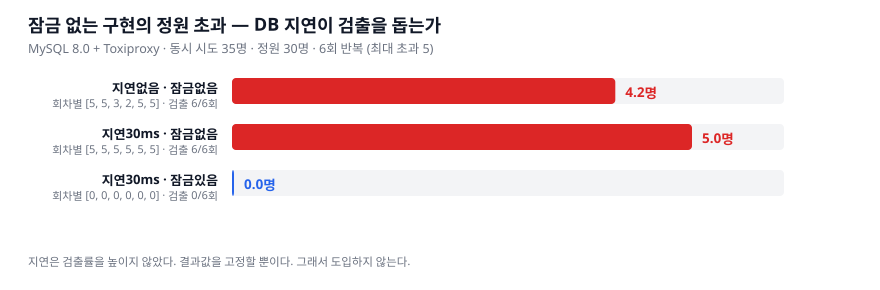

# 06. 잠금 테스트를 결정론적으로 만들 수 있나 — 가설과 실측

> 이슈 [#17](https://github.com/dj258255/edumeet/issues/17)

## 가설

[#17](https://github.com/dj258255/edumeet/issues/17) 에 이렇게 적었다.

> 현재는 20 스레드가 우연히 경합해야 버그가 잡히는데, DB 응답에 인위적 지연을 넣으면
> 레이스 윈도우가 넓어져 락이 없을 때 **100% 재현**된다.

잠금 없는 구현의 버그(정원 초과)는 *"센다 → 비교한다 → 기록한다"* 사이에 다른 요청이
끼어들어야 드러난다. 그 창이 좁으면 실행에 따라 초과가 0 이 나올 수 있고,
**그러면 테스트가 버그를 놓친다.**

DB 응답에 지연을 넣으면 창이 넓어질 것이다 — 라는 것이 가설이었다.

```
앱 --> toxiproxy:13307 --[latency]--> mysql:3306
```

```bash
./scripts/run-lock-determinism.sh
ATTEMPTS=35 CAPACITY=30 ROUNDS=6 DB_LATENCY_MS=30 ./scripts/run-lock-determinism.sh
```

## 1차 측정 — 고부하(150명이 정원 30에 몰림)

| 조건 | 회차별 초과 인원 | 버그 검출 |
|---|---|---|
| 지연 없음 · 잠금 없음 | `[6, 14, 7]` | **3/3** |
| 지연 20ms · 잠금 없음 | `[11, 23, 1]` | **3/3** |
| 지연 20ms · 비관적 잠금 | `[0, 0, 0]` | 0/3 |

**가설이 지지되지 않았다.** 지연을 넣으나 안 넣으나 검출률이 같고,
오히려 지연 쪽 분산이 커졌다(1~23명).

이유는 짐작이 된다 — **150명이 정원 30에 몰리면 경합 창이 이미 충분히 넓다.**
120명이 거절당해야 하는 상황이라 지연이 더할 것이 없다.
**시험이 너무 쉬웠다.** 가설을 제대로 재려면 경합이 아슬아슬한 조건이어야 한다.

## 2차 측정 — 저부하(35명이 정원 30에 몰림, 최대 초과 5)

| 조건 | 회차별 초과 인원 | 버그 검출 |
|---|---|---|
| 지연 없음 · 잠금 없음 | `[5, 5, 3, 2, 5, 5]` | **6/6** |
| 지연 30ms · 잠금 없음 | `[5, 5, 5, 5, 5, 5]` | **6/6** |
| 지연 30ms · 비관적 잠금 | `[0, 0, 0, 0, 0, 0]` | 0/6 |



## 결론 — 가설은 절반만 맞았다

**틀린 부분** — 지연이 *검출률*을 높이지 않았다. 지연 없이도 6/6 이다.
HTTP 계층을 거치는 k6 부하에서는 요청 간 간격이 이미 충분히 겹친다.

**맞은 부분** — 지연을 넣으면 *결과값*이 결정론적이다.
지연 없으면 초과가 2~5 로 흔들리는데, 지연 30ms 를 넣으면 **항상 최대치인 5** 다.

즉 판정 방식에 따라 필요 여부가 갈린다.

```java
assertThat(overflow).isGreaterThan(0);   // 지연 불필요 — 지금도 6/6
assertThat(overflow).isEqualTo(5);       // 지연 필요 — 없으면 흔들린다
```

## 그래서 도입하지 않는다

**테스트에는 `overflow > 0` 단언이면 충분하다.** 정원 초과가 몇 명인지는 경합 결과라
본질적으로 값이 정해지지 않는다. *"정확히 5명이 초과해야 한다"* 는 단언은
**구현이 아니라 스케줄링을 고정하는 단언**이라 의미가 없다.

지연을 넣으면 얻는 것은 "숫자가 예쁘게 고정된다" 뿐이고, 잃는 것은
**Toxiproxy 라는 인프라 의존성과 테스트 실행 시간**이다. 값이 비용보다 작다.

> 이 실험 자체가 무의미했던 것은 아니다. **"필요하다고 생각했는데 재보니
> 필요 없었다"** 를 확인한 것이 결과다. 가설대로 도입했다면 인프라 하나를
> 근거 없이 늘렸을 것이다.

## 부수적으로 확인된 것

**비관적 잠금은 DB 지연 30ms 를 넣어도 정원을 정확히 지킨다.** 9회 전부 초과 0 이다.
잠금이 지연에 취약하지 않다는 것을 보였다 — 잠금 구간이 길어져도 직렬화는 유지된다.

## 한계

- 회차가 6회다. 검출률 6/6 을 "100%" 라고 단언하기엔 표본이 작다.
  **"이 조건에서 6회 모두 검출됐다"** 가 정확한 표현이다.
- 앱·MySQL·Toxiproxy·k6 가 같은 노트북에서 돌았다.
- 지연 20/30ms 만 시험했다. 훨씬 큰 지연에서는 다른 양상일 수 있다.
