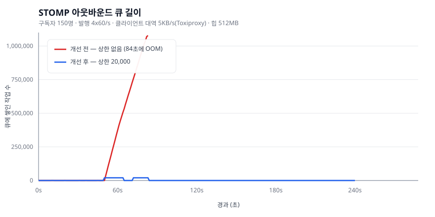
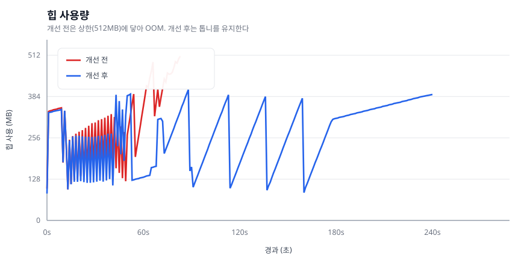
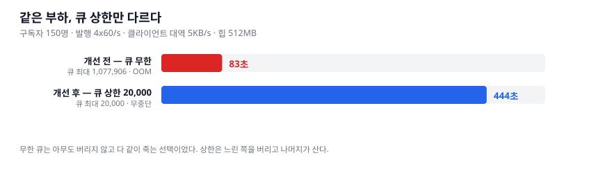

# 무한 큐 OOM — 가정이 틀렸고, 그래서 조건을 찾았다

> 측정 2026-08-23 · #43 · 붕괴 ③

## 0. 결론

| | 개선 전 | 개선 후 |
|---|---:|---:|
| 아웃바운드 큐 최대 | **1,077,906** | **20,000** (= 상한) |
| 인바운드 큐 최대 | 1,554 | **2,000** (= 상한) |
| 힙 최대 | 509 MB / 512 MB | 405 MB |
| 결과 | **84초에 OOM** | **444초 무중단** |
| 강제 종료 세션 | 32 | 150 |

**큐가 정확히 상한에서 평평해졌다.** 그게 상한이 실제로 걸렸다는 직접 증거다.



---

## 1. 처음 가정이 틀렸다

STOMP 채널의 기본 실행기는 큐 용량이 `Integer.MAX_VALUE` 다.
그래서 **"빠르게 발행하면 큐가 쌓여 OOM 이 난다"** 고 가정하고 부하를 걸었다.

```
구독자 150명 · 발행 4×60/s · 힙 512MB · 4분
→ 초당 36,000건 전달 시도
```

**OOM 이 나지 않았다.**

| | |
|---|---|
| 아웃바운드 큐 최대 | **525** — 쌓였다가 바로 빠짐 |
| 힙 | 톱니 패턴, GC 급감 100회 |
| e2e p95 | **7 ms** |
| 결과 | 4분 내내 생존 |

서버는 초당 36,000건 전달을 **여유롭게 소화했다.**

> **무한 큐가 위험해지는 조건은 "빠른 발행" 이 아니라 "느린 소비" 다.**
> k6 클라이언트는 루프백에서 즉시 읽어간다. 아무리 빨리 밀어 넣어도 그만큼 빠진다.

계획 문서에 이미 적혀 있던 문장이 여기서 의미를 가졌다 —
*"느린 클라이언트를 만드는 법. k6 로는 못 만든다."*

## 2. 조건을 만들었다 — Toxiproxy 로 소비를 늦춘다

```
k6 --> toxiproxy:18081 --[bandwidth 5KB/s downstream]--> app:8081
```

연결당 5 KB/s. 150 연결이면 750 KB/s 인데, 필요한 것은 초당 36,000건 × 약 200B = **7.2 MB/s** 다.
**10배 부족하게** 만들었다.

같은 부하, 같은 힙. 결과가 완전히 달라졌다.

```
84초    java.lang.OutOfMemoryError: Java heap space
        큐 1,077,906 · 힙 509MB/512MB
        힙 덤프 878MB
```



**힙 그래프가 교과서적인 OOM 신호를 보여준다.**
50초까지는 톱니로 회수되다가, 그 뒤로 **회수를 못 하고 512MB 까지 직진**한다.

## 3. Spring 의 자체 보호는 작동했는데도 부족했다

로그를 보면 Spring 이 손을 놓고 있었던 게 아니다.

```
Terminating 'StandardWebSocketSession[...]':
  Send time 16820 (ms) for session '...' exceeded the allowed limit 10000
```

**세션 32개를 강제 종료했다.** 그런데도 죽었다.

> 보호가 **세션 단위(send 경로)에만 있고 실행기 큐에는 없었다.**
> 느린 세션을 끊는 속도보다 큐가 쌓이는 속도가 빨랐다. 층이 하나 비어 있었다.

## 4. 그 층을 채웠다

```java
private ThreadPoolTaskExecutor boundedExecutor(String prefix, int queueCapacity) {
    ThreadPoolTaskExecutor executor = new ThreadPoolTaskExecutor();
    executor.setQueueCapacity(queueCapacity);
    executor.setRejectedExecutionHandler(new ThreadPoolExecutor.CallerRunsPolicy());
    ...
}
```

### `TaskExecutorRegistration` 으로는 안 된다

`ChannelRegistration.taskExecutor()` 가 돌려주는 `TaskExecutorRegistration` 에는
`corePoolSize` · `queueCapacity` 는 있지만 **`RejectedExecutionHandler` 를 설정하는 메서드가 없다.**
그래서 실행기를 직접 만들어 `taskExecutor(TaskExecutor)` 오버로드로 넘긴다.

### 왜 CallerRuns 인가

버리는 대신 **부르는 쪽이 직접 처리**하게 해서 역압을 위로 전달한다.
채팅은 순서가 있는 대화라 조용히 버리면 대화가 깨진다. 느려지는 편이 낫고,
**느려지는 것은 지표에 드러난다** — 큐 길이가 상한에 붙는다.

### 세션 보호도 같이 조였다

```java
registration.setSendTimeLimit(5_000);            // 기본 10초
registration.setSendBufferSizeLimit(256 * 1024); // 기본 512KB
```

큐 상한만으로는 부족하다. **느린 클라이언트가 큐를 계속 채우는 것 자체**를 빨리 끊어야 한다.

## 5. 살아남은 것은 공짜가 아니다



| | 개선 전 | 개선 후 |
|---|---:|---:|
| 강제 종료 세션 | 32 | **150** |

**느린 클라이언트를 더 빨리 포기해서 살아남았다.**

> 무한 큐는 **"아무도 버리지 않고 다 같이 죽는"** 선택이었다.
> 상한은 **"느린 쪽을 버리고 나머지가 사는"** 선택이다.
>
> 드롭이 0인 게 좋은 게 아니다. **0이라는 것은 아직 버릴 판단을 안 했다는 뜻**이고,
> 판단을 미루면 결정은 OOM 이 대신 내린다.

## 6. 재현

```bash
docker compose -f docker-compose.perf.yml up -d mysql redis toxiproxy

# 느린 소비자를 만든다
curl -X POST localhost:8474/proxies -d '{"name":"app_ws","listen":"0.0.0.0:18081",
  "upstream":"host.docker.internal:8081","enabled":true}'
curl -X POST localhost:8474/proxies/app_ws/toxics -d '{"name":"slow_downstream",
  "type":"bandwidth","stream":"downstream","attributes":{"rate":5}}'

./scripts/run-chat-oom.sh
python3 scripts/make_chat_oom_chart.py
```

차트는 측정 CSV 에서 생성한다. **수치를 손으로 옮기지 않는다.**

## 7. 한계

- **같은 머신에서 부하 도구와 앱을 돌렸다.** 절대 수치가 아니라 전/후 비교로만 읽어야 한다
- 힙 512MB 는 재현을 빠르게 하려고 조인 값이다. **조인 것은 "언제 죽는가" 이지 "죽는가" 가 아니다**
- 큐 상한 20,000 / 2,000 은 이 부하에서 정한 값이다. **값 자체보다 상한이 있다는 사실이 중요하다**
- 힙 덤프(878MB)를 확보했지만 **Eclipse MAT 으로 열어보지는 않았다.**
  큐 길이 지표가 직접 증거라 판단했다
- `INTERACTIVE` 는 저장 경로가 있어 큐 소진이 더 느릴 수 있다. **이번 측정은 `BROADCAST` 만 했다**
