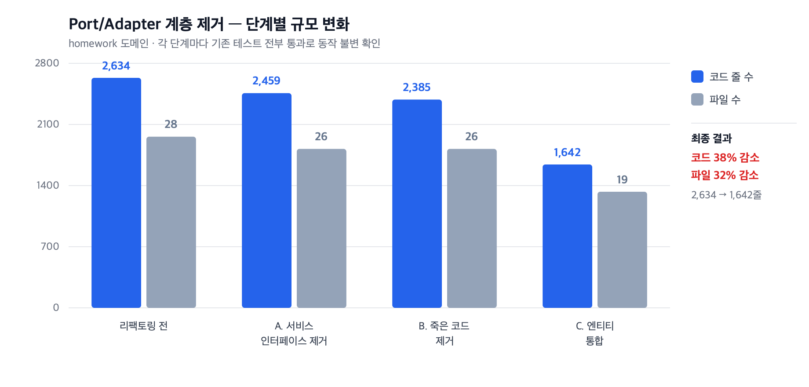

# Port/Adapter 계층 제거

> 관련 이슈 [#3](https://github.com/dj258255/edumeet/issues/3)

## 한 줄 요약

`homework` 도메인의 헥사고날 구조를 계층형으로 통일했다.
**28파일 2,634줄 → 19파일 1,642줄 (코드 38% 감소).**
각 단계마다 기존 테스트 전부 통과로 동작 불변을 확인했다.



---

## 1. 시작 — 인터페이스 15개 중 14개가 구현체 하나뿐이었다

프로젝트에서 직접 정의한 인터페이스(Spring Data 리포지토리 제외)를 전수 조사했다.

```
BoardRepository       BoardSearchRepository   BoardCategoryRepository
BoardService          BoardCategoryService    AttachmentService
ReplyRepository       ReplyService            AssignmentRepository
SubmissionRepository  AssignmentService       SubmissionService
AuthCodeService       OAuth2UserInfo
```

**15개 중 14개(93%)가 구현체 1개뿐**이다.

`Assignment` 하나를 조회하는 데 파일 3개가 관여하고 있었다.

```
application/AssignmentRepository.java        Port 인터페이스 (직접 정의)
infrastructure/AssignmentJpaRepository.java  Spring Data
infrastructure/AssignmentRepositoryImpl.java Adapter (JpaRepository 에 위임)
```

---

## 2. 그런데 진단을 한 번 수정해야 했다

"구현체가 하나뿐이니 전부 걷어내자"로 시작했으나, 도메인 모델을 열어보니
빈 껍데기가 아니라 **불변 도메인 모델**이었다.

```java
public Assignment update(String title, String description)   // 새 인스턴스 반환
public Assignment addAttachmentFile(Attachment file)
public Assignment initializeStudentStatuses(List<ClassMember> members)
```

JPA 엔티티는 가변이어야 하므로 **단순히 합치면 이 불변성이 사라진다.**
분리에 근거가 있었던 셈이다.

### 그래서 실제 호출 횟수를 셌다

| 메서드 | 호출 |
|---|---|
| `addAttachmentFile` | 2회 |
| `initializeStudentStatuses` | 1회 |
| `update()` | **0회** |
| `updateAttachmentFiles()` | **0회** |
| `isCreatedBy()` | **0회** |
| `Submission.updateSubmissionFiles()` | **0회** |
| `Submission.isSubmittedBy()` | **0회** |

**행위 메서드의 절반 이상이 호출되지 않았다.**

> ### 조사가 한 번 틀렸다
>
> 처음에는 미사용을 8개로 판단했다. 정의 파일을 제외하고 사용처를 세는 방식이라
> **도메인 클래스끼리의 호출을 놓쳤다.**
> `StudentSubmissionStatus.notSubmitted()` 는 `Assignment.initializeStudentStatuses()` 가
> 호출하고 있었고, 컴파일러가 잡아냈다. 두 메서드는 복원했다.

### 수정된 진단

**"헥사고날이 과하다"가 아니라 "분리가 값을 못 하고 있다".**
설계 의도는 있었으나 실현되지 않은 상태였고, 지불하는 비용은 명확했다.

- Adapter 422줄
- 목록 조회에서 DTO 프로젝션 불가
- Port 가 노출하지 않은 최적화 쿼리가 죽은 코드가 됨

---

## 3. 단계별 실행

각 단계마다 **기존 테스트 전부 통과**로 동작 불변을 확인했다.

### A. 서비스 인터페이스 제거 — 2,634 → 2,459줄

인터페이스가 계약이 아니라 **구현을 담고 있었다.**
`AssignmentService` 145줄 중 대부분이 DTO 매핑 `default` 메서드였고,
실제 계약은 메서드 시그니처 10개뿐이었다.

```java
public interface AssignmentService {
    default StudentSubmissionStatusDTO statusToDto(...) { ... }  // 매핑 로직
    default AssignmentDTO domainToDto(...)              { ... }  // 매핑 로직
    default Assignment createDtoToDomain(...)           { ... }  // 매핑 로직
    // 계약은 아래 10개뿐
    Long createAssignment(...);
    ...
}
```

### B. 죽은 코드 제거 — 2,459 → 2,385줄

- 호출되지 않는 도메인 행위 메서드 5개
- 죽은 페치 조인 쿼리 2개 (`findByClassIdWith...`)
- 상세 조회의 카테시안 곱 (아래 별도 절)

### C. 도메인 모델 ↔ JPA 엔티티 통합 — 2,385 → 1,642줄

```
제거    Port 2개 · Adapter 422줄 · XxxJpaEntity 5개 (toDomain/fromDomain 포함)
통합    domain/Assignment, Submission, StudentSubmissionStatus,
        AssignmentFileUpload, SubmissionFileUpload
이동    JpaRepository -> repository 패키지, Jpa 접미사 제거
```

JPA 엔티티는 가변이므로 행위 메서드가 자신을 바꾼다.

```java
// 통합 전 (불변)                              // 통합 후
Assignment r = a.addAttachmentFile(f);         a.addAttachmentFile(f);
repository.save(r);                            repository.save(a);
```

### D. 패키지 정리

```
application  -> service
presentation -> controller
presentation/dto -> dto
```

`classroom` / `member` / `openvidu` 와 같은 구조가 되었다.

---

## 4. ★ 테스트가 잡아낸 의미 변화 2건

가장 중요한 부분이다. **Port 계층이 표준 이름 뒤에 다른 의미를 숨기고 있었다.**

### (1) `deleteById` — 소프트 삭제가 물리 삭제로 바뀌었다

```java
// Port 의 구현 (Adapter)
public void deleteById(Long id) {
    jpaRepository.findById(id).ifPresent(e -> { e.delete(); jpaRepository.save(e); });
}
```

`deleteById` 라는 이름은 같지만 **Spring Data 의 `deleteById` 는 물리 삭제**다.
통합 후 그대로 두었더니 행이 사라져 복원이 불가능해졌다.

```
AssertionError: 복원할 수 없는 과제입니다: 62
```

### (2) `findById` — 소프트 삭제 필터가 사라졌다

```java
// Port 의 구현 (Adapter)
public Optional<Assignment> findById(Long id) {
    return jpaRepository.findByIdAndDeletedAtIsNull(id).map(...);   // 필터링
}
```

Spring Data 의 `findById` 는 **삭제된 행도 반환**한다.

```
AssertionError: 삭제된 과제가 여전히 조회 가능합니다
```

조회 경로는 `findByIdAndDeletedAtIsNull` 로 바꾸고,
**복원 경로만 `findById` 를 유지**했다. 복원은 삭제된 행을 찾아야 하기 때문이다.

> 두 버그 모두 **컴파일은 통과한다.** 이름과 시그니처가 같기 때문이다.
> 테스트가 없었으면 그대로 배포됐을 변경이다.

---

## 5. 부수적으로 드러난 것

### 임시 엔티티를 만들어 DTO 를 채우고 있었다

```java
// 통합 전 — DTO 를 만들려고 도메인 객체를 새로 생성
enrichedStatus = StudentSubmissionStatus.submitted(
        status.getAssignmentId(), status.getStudentEmail(), ...);
return statusToDto(enrichedStatus, attachmentAdapter);
```

통합 후 이 타입은 JPA 엔티티다. **영속 컨텍스트 밖 인스턴스를 만들어 쓰는 것은 위험하다.**
표현 계층 변환은 DTO 에서 끝내도록 바꿨다.

### Adapter 의 `save()` 가 업데이트마다 엔티티를 재생성하고 있었다

```java
if (isUpdate) {
    existingEntity.get().getAttachmentFiles().clear();     // 기존 첨부 제거
    assignmentJpaEntity = AssignmentJpaEntity.fromDomain(assignment);  // 통째로 재생성
}
```

도메인 모델에는 영속성 정보가 없으니 매번 새로 만들 수밖에 없었다.
통합하면서 이 231줄이 전부 사라지고 `save()` 는 그냥 `save()` 가 되었다.

---

## 6. 결과

| 단계 | 파일 | 줄 | 테스트 |
|---|---|---|---|
| 리팩토링 전 | 28 | 2,634 | 171 통과 |
| A. 서비스 인터페이스 제거 | 26 | 2,459 | 171 통과 |
| B. 죽은 코드 제거 | 26 | 2,385 | 173 통과 |
| **C. 엔티티 통합** | **19** | **1,642** | **164 통과** |

> C 단계에서 테스트가 173 → 164 로 줄어든 것은
> `AssignmentRepositoryImplTest` 9건이 **대상 클래스와 함께 제거**되었기 때문이다.
> 사라진 어댑터를 검증하던 테스트다.

### 최종 구조

```
homework
├── controller   2
├── service      2
├── repository   4
├── domain       6
└── dto          5
```

---

## 7. 한계 (정직하게)

- **`homework` 도메인만 적용했다.** `board`, `reply`, `attachment` 는 여전히
  헥사고날 구조이고 같은 문제를 갖고 있다. 순차 적용이 남아 있다.
- **매핑 로직이 서비스에 남아 있다.** 서비스 인터페이스의 `default` 메서드를
  서비스 클래스로 옮겼을 뿐이다. 전용 매퍼나 DTO 정적 팩토리로 분리하는 것이 더 낫다.
- **테스트가 동작 불변을 완전히 보장하지는 않는다.** 164건이 통과했지만
  커버되지 않은 경로에서 같은 종류의 의미 변화가 남아 있을 수 있다.
  실제로 두 건은 테스트가 있었기에 잡혔다.
- **DTO 프로젝션을 아직 적용하지 않았다.** 통합의 주요 동기 중 하나였으나
  이번 범위에서는 구조 정리까지만 했다. 적용은 별도 작업이다.

---

## 8. 배운 것

1. **인터페이스 개수보다 "지우면 무엇이 깨지는가"를 먼저 세야 한다.**
   구현체가 하나뿐이라는 사실만으로는 근거가 약했다.
   행위 메서드의 실제 호출 횟수를 센 뒤에야 판단이 섰다.

2. **표준 이름이 다른 의미를 숨길 수 있다.**
   `findById` / `deleteById` 는 누구나 아는 이름이지만 Port 뒤에서 다르게 동작했다.
   컴파일러는 이런 변화를 잡지 못한다.

3. **조사 방법 자체가 틀릴 수 있다.**
   사용처를 세는 스크립트가 도메인 내부 호출을 놓쳤다.
   결과를 그대로 믿지 않고 컴파일과 테스트로 교차 검증해야 한다.

4. **큰 리팩토링일수록 단계를 쪼개고 매 단계 테스트를 돌려야 한다.**
   한 번에 했다면 두 버그의 원인을 찾는 데 훨씬 오래 걸렸을 것이다.
